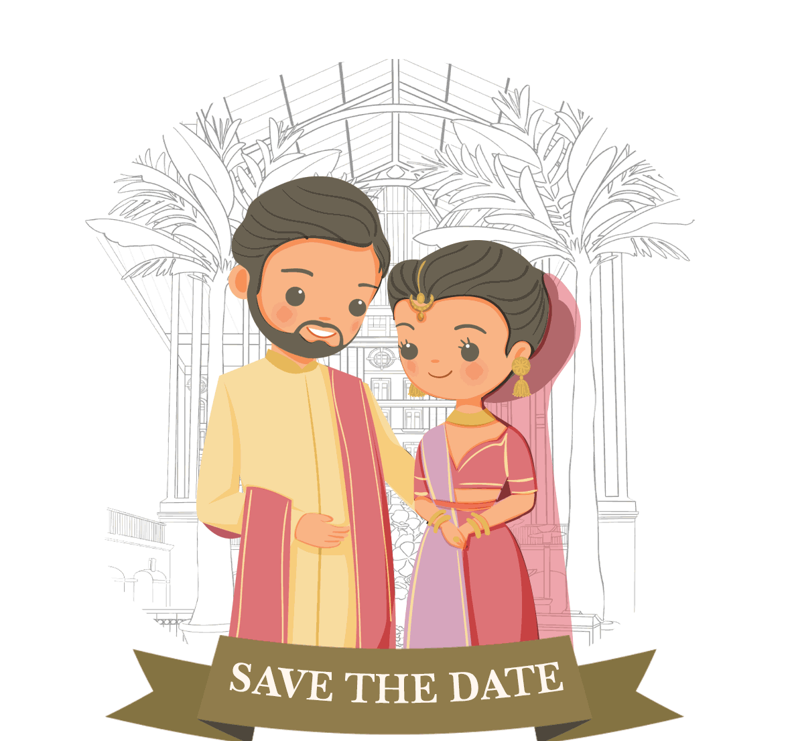

    

Welcome to **wedding invitation website** repository! 💍✨ 
 
This project is lovingly built using **HTML**, **CSS**, and **JavaScript** to create a beautiful, interactive, and personalized platform to invite friends and family to join in the celebration of our big day.

Feel free to explore the code, customize it to reflect your own unique story, and use it as a template for your special occasion. Whether you're announcing your wedding date, sharing event details, or just adding a little magic with animation and styling — this is a perfect starting point.

We hope this inspires joy and creativity as you build your own memorable wedding site. 💕  
Wishing you love, laughter, and a lifetime of happiness together!
